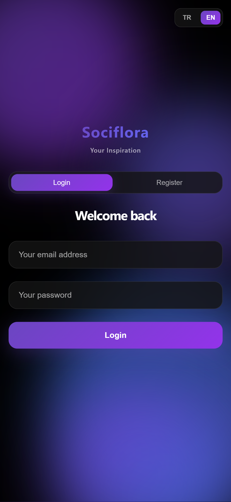
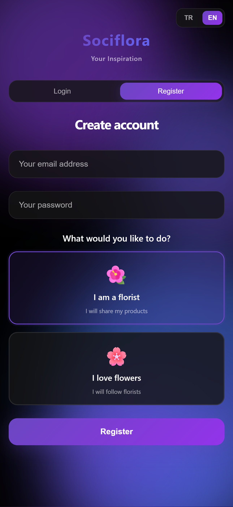
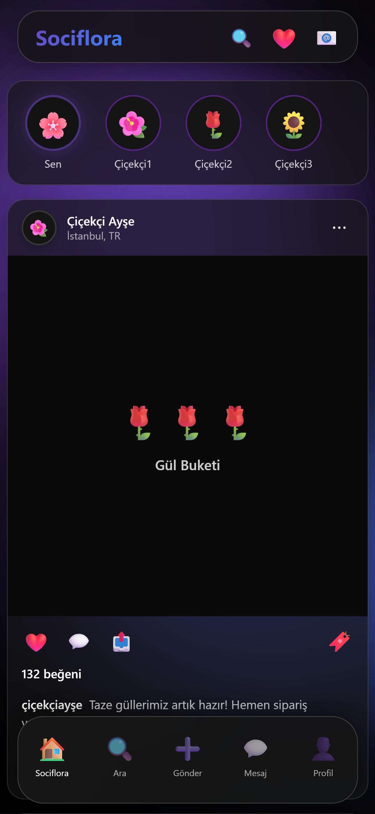
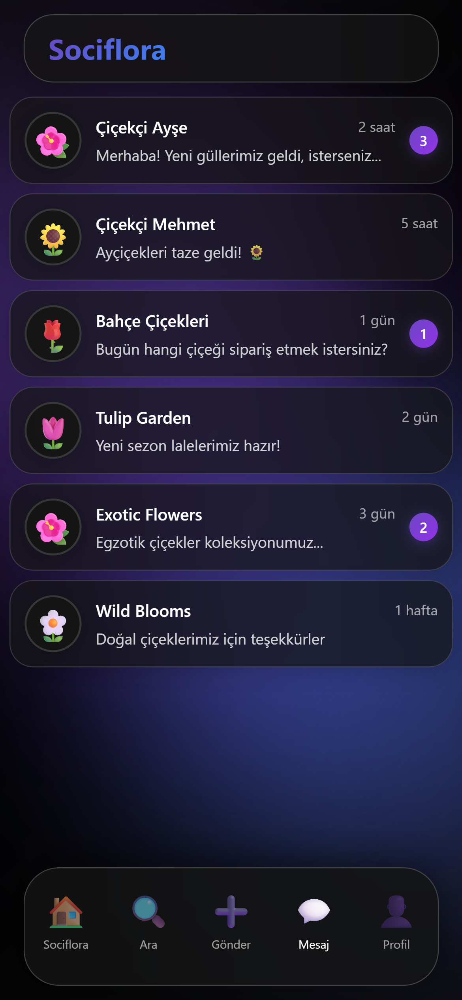
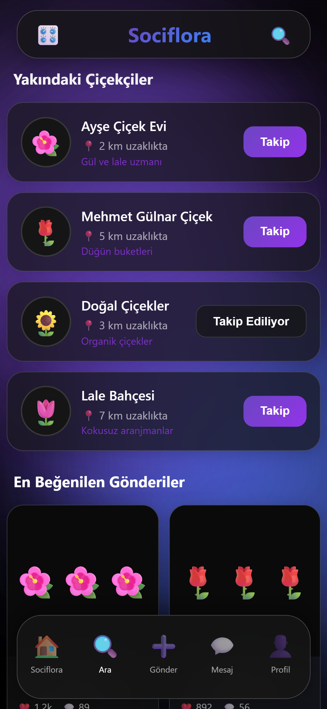
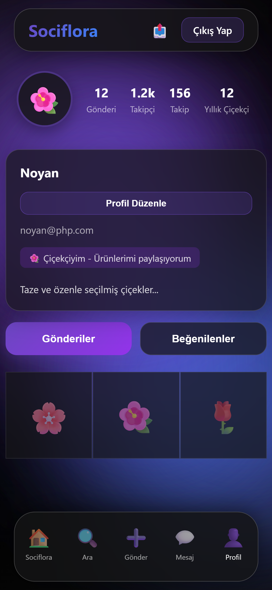

# 🌺 Sociflora
**The World's First Social Media Platform for Florists**  
**Dünyanın İlk Çiçekçilere Özel Sosyal Medya Prototipi**

[](https://www.php.net/)
[](https://www.sqlite.org/)
[](https://developer.mozilla.org/en-US/docs/Web/HTML)
[](https://developer.mozilla.org/en-US/docs/Web/CSS)
[](https://developer.mozilla.org/en-US/docs/Web/JavaScript)

Modern glassmorphism tasarımı ve yüzen ada animasyonları ile çiçekçilere özel sosyal medya platformu.



## 🌸 Özellikler / Features

- 🌸 **Glassmorphism Design** - Modern siyah cam yüzen ada tasarımı
- 🌊 **Animated Backgrounds** - Animasyonlu mor-mavi gradyan yüzen adalar
- 📱 **Fully Responsive** - Mobil, tablet ve desktop uyumlu
- 💎 **SQLite Database** - Hafif ve hızlı veritabanı
- 🔐 **Secure Sessions** - Güvenli PHP session yönetimi
- 🎨 **Purple-Blue Gradient Theme** - Modern renk paleti
- 👤 **User Authentication** - Login/Register sistemi
- 🔄 **Mode Toggle** - Giriş/Kayıt modu değiştirme
- 🌐 **TR/EN Support** - Çift dil desteği
- 📤 **Instagram-like Interface** - Tanıdık kullanıcı arayüzü

## 💡 Konsept / Concept

Sociflora, **çiçekçiler ve çiçek severler** için özel tasarlanmış bir sosyal medya prototipidir.

### 👥 Kullanıcı Tipleri / User Types

- **🌺 Çiçekçiler (Florists)**: Ürünlerini paylaşır, müşterileriyle iletişime geçer
- **🌸 Çiçek Severler (Flower Lovers)**: Çiçekçileri takip eder, beğeni ve yorum yapar

## 📸 Ekran Görüntüleri / Screenshots

### Login Sayfası / Login Page


### Kayıt Sayfası / Register Page  


### Ana Sayfa / Dashboard


### Mesajlar / Messages


### Arama / Search


### Profil / Profile


### Gönderi Oluştur / Create Post


## 🚀 Kurulum / Installation

### Gereksinimler / Requirements

- PHP 7.4+ 
- XAMPP (Apache + PHP)
- Modern web tarayıcısı

### Kurulum Adımları / Installation Steps

#### Türkçe:

1. **Veritabanını başlat:**
```bash
php init_db.php
```

2. **XAMPP Apache sunucusunu başlat**

3. **Tarayıcıda aç:**
```
http://localhost/
```

4. **Demo kullanıcı ile giriş yap:**
   - Email: demo@sociflora.com
   - Şifre: demo123

#### English:

1. **Initialize database:**
```bash
php init_db.php
```

2. **Start XAMPP Apache server**

3. **Open in browser:**
```
http://localhost/
```

4. **Login with demo user:**
   - Email: demo@sociflora.com
   - Password: demo123

## 📁 Proje Yapısı / Project Structure

```
sociflora/
├── index.html              # Login/Register sayfası
├── style.css               # Glassmorphism stilleri
├── script.js               # Frontend JavaScript
├── dashboard.php          # Ana feed sayfası
├── search.php             # Arama sayfası
├── post.php               # Gönderi oluşturma
├── messages.php           # Mesaj listesi
├── chat.php               # Mesaj detay
├── profile.php            # Kullanıcı profili
├── login_handler.php      # Giriş işlemleri
├── register_handler.php   # Kayıt işlemleri
├── init_db.php            # Veritabanı başlatıcı
├── dashboard.js           # Dashboard JS
├── messages.js            # Messages JS
├── config.php             # DB konfigürasyonu
└── database.sqlite        # SQLite DB (otomatik)
```

## 🛠️ Teknolojiler / Technologies

| Teknoloji | Kullanım |
|-----------|----------|
| **PHP** | Backend işlemleri |
| **SQLite** | Veritabanı |
| **HTML5** | Yapı |
| **CSS3** | Glassmorphism tasarım |
| **JavaScript** | İnteraktivite |
| **Glassmorphism** | Modern UI trendi |

## 🎨 Tasarım Prensipleri / Design Principles

- **Glassmorphism**: Yarı saydam cam efektli kartlar
- **Floating Islands**: Mor-mavi gradient animasyonlu arka planlar
- **Responsive**: Mobile-first yaklaşım
- **Instagram-like UX**: Tanıdık kullanıcı deneyimi

## 💻 Kullanım / Usage

### Giriş Yapma / Login
1. `http://localhost/` adresine gidin
2. Demo kullanıcı bilgileri ile giriş yapın
3. Ana sayfada çiçekçi postlarını görüntüleyin

### Kayıt Olma / Register
1. "Kayıt Ol" butonuna tıklayın
2. Kullanıcı tipinizi seçin (Çiçekçiyim / Çiçek seviyorum)
3. Email ve şifre girin
4. Profilinizi oluşturun

## 🤝 Katkıda Bulunma / Contributing

Proje hala geliştirilme aşamasındadır. Katkılarınızı bekliyoruz!

## 📄 Lisans / License

Bu proje eğitim ve deneme amaçlı açık kaynaklıdır.

---

Made with ❤️ for Florists around the world 🌺

**Sociflora** - The first social media platform designed exclusively for florists and flower lovers.
